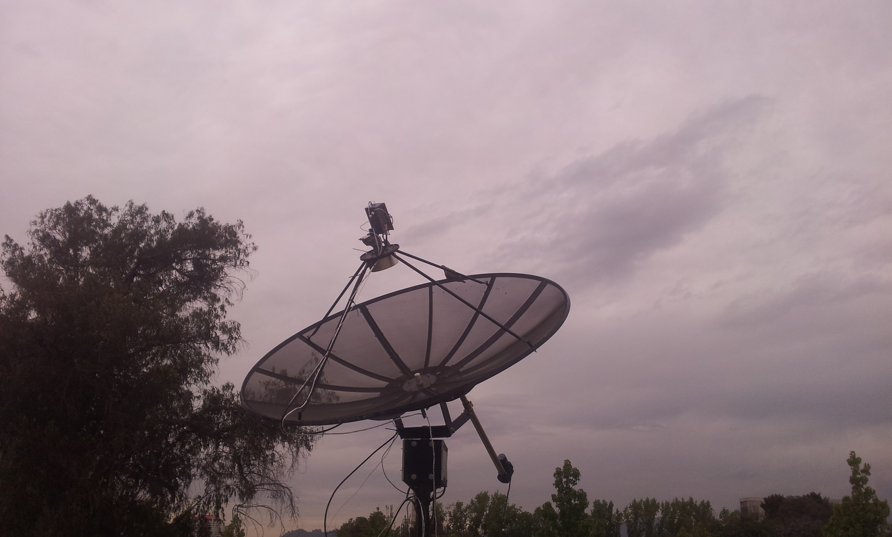

.. _getting_started:

***************
Getting started
***************

Installing the ARC python module
================================

Fetch the files from `ARI@PUC <https://sites.google.com/site/ariatpuc/>`_
then it should be as easy as::

  python setup.py install

After installing you can clean the current directory with::

  python setup.py clean

Now you are ready to go scare some pigeons, they might
be interfering with the signals

